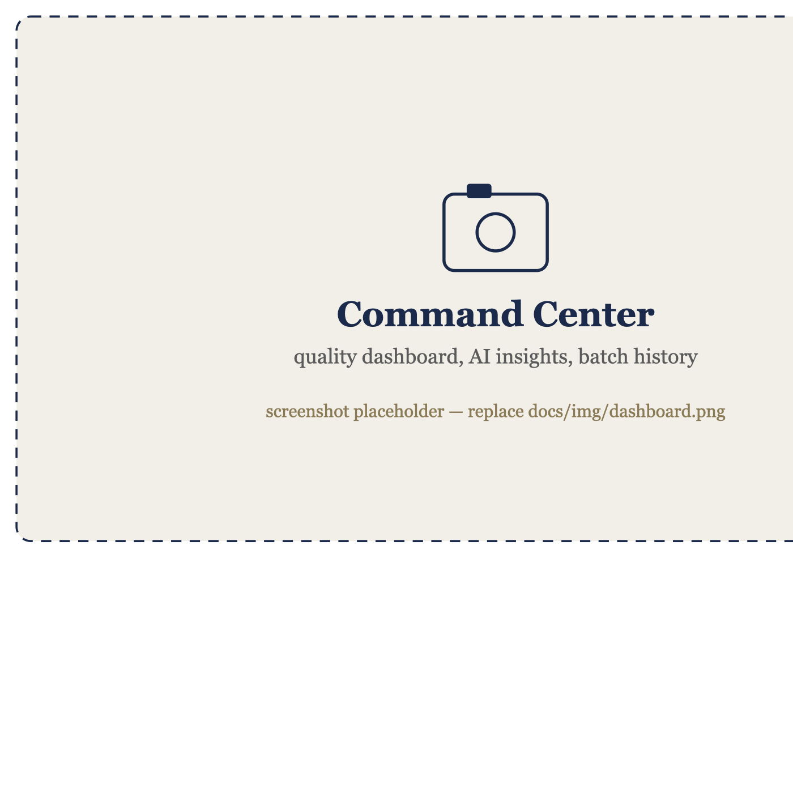
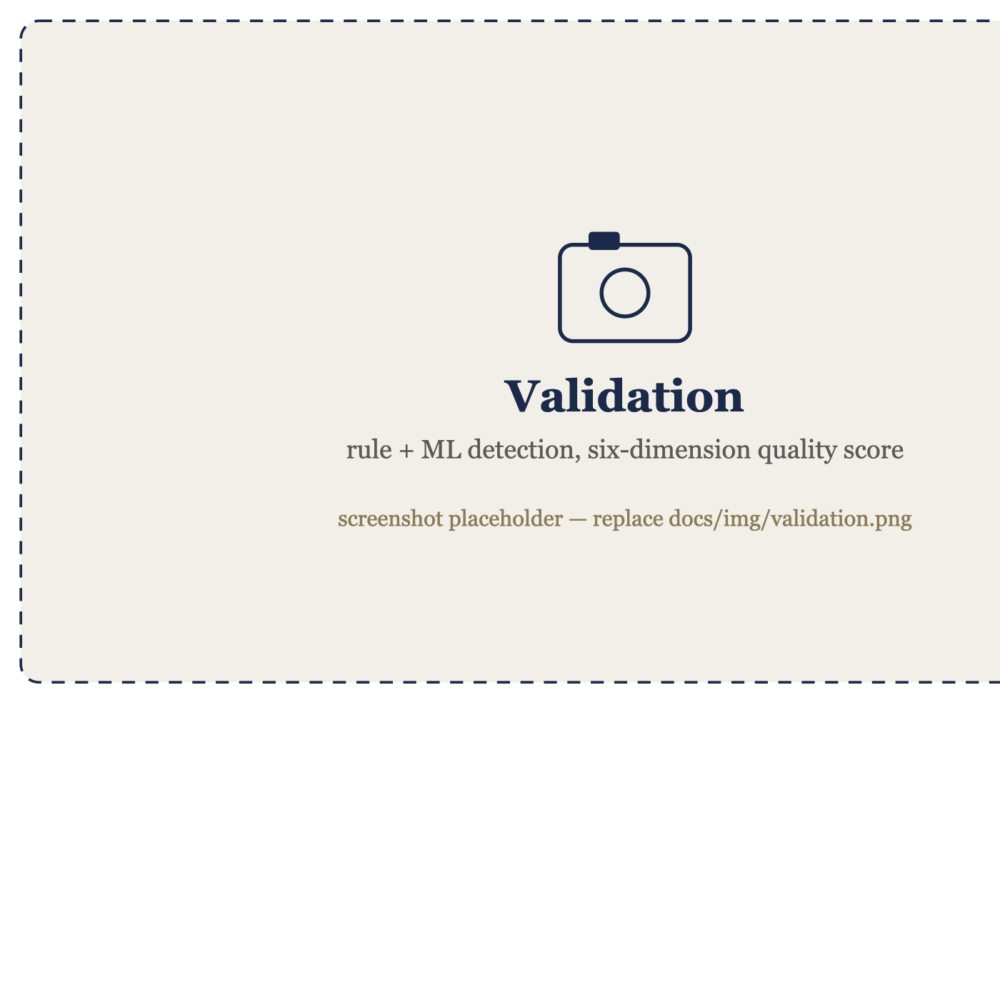
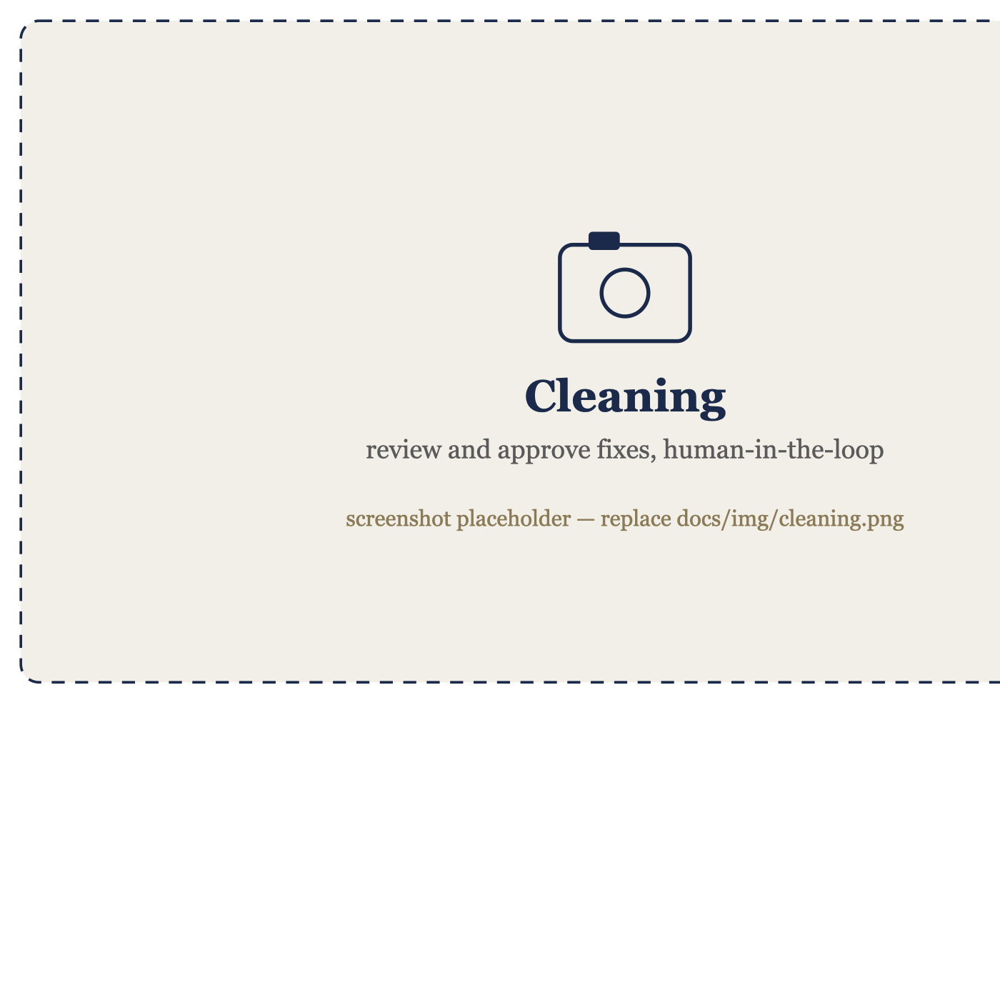
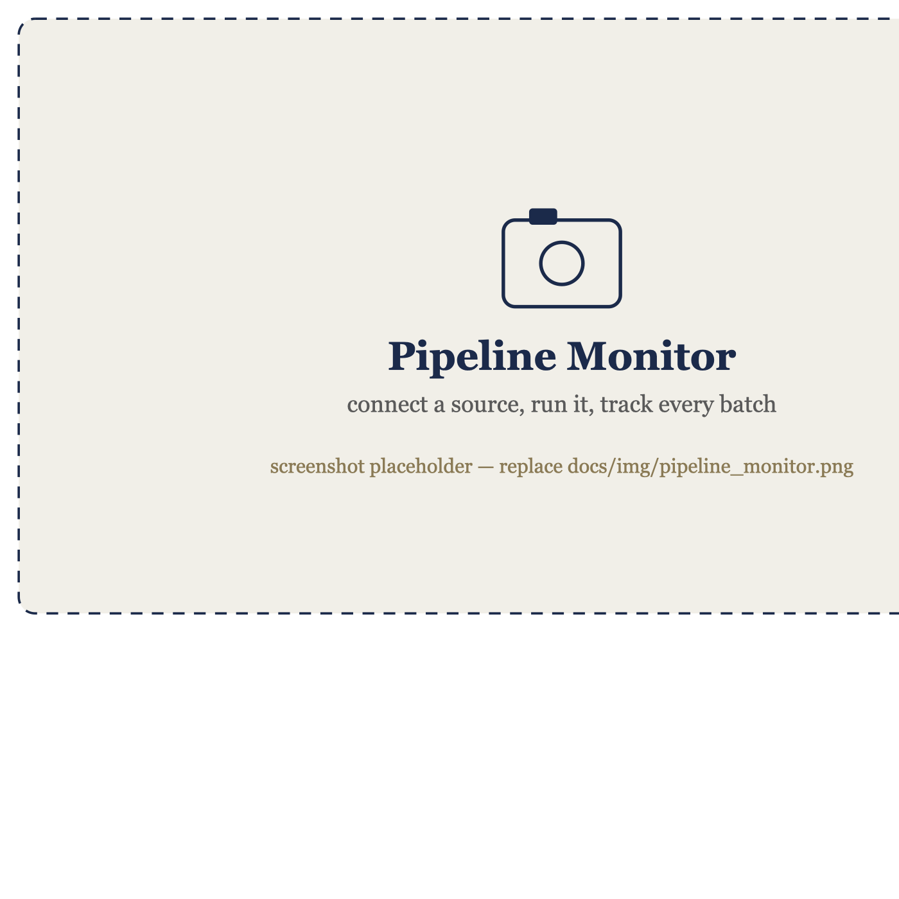
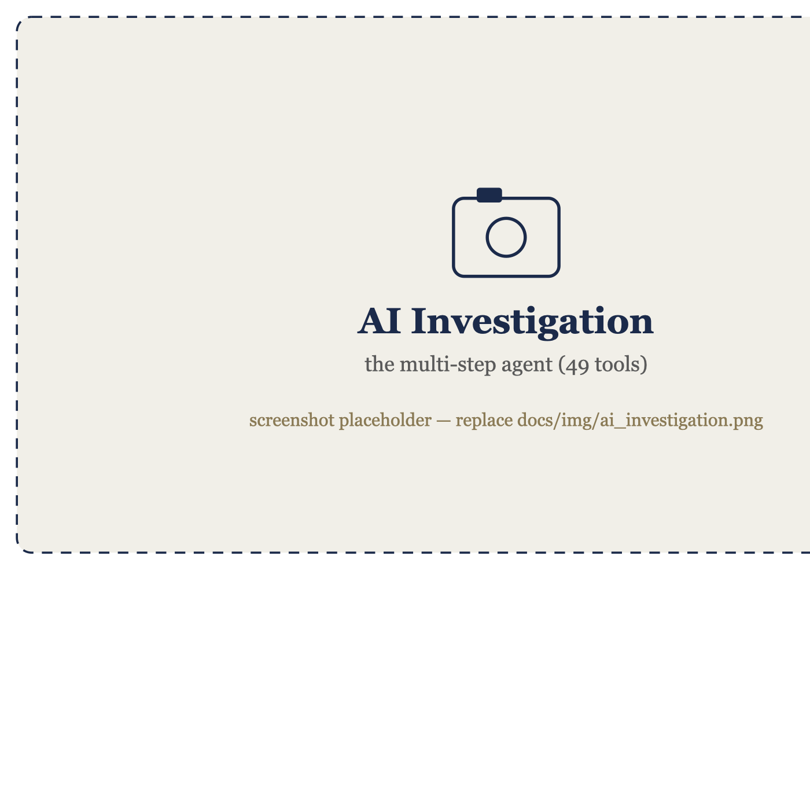

<div align="center">

# DataQualify

### Explainable, weakly-supervised data quality for financial data

Detect, explain, and correct errors in tabular data — with a deterministic,
auditable core and an agent that handles each batch on its own.




</div>

---

## What it is

DataQualify finds and fixes errors in tabular financial datasets (KYC records,
transactions, claims) by combining **explicit domain rules**, a **clean reference
dataset**, and **unsupervised statistical learning** — *without labelled training
data*. Every decision is deterministic and carries a human-readable rationale (the
rule that fired, the expected value, a regulatory citation), so the output is
auditable for regulated use.

One shared engine sits behind **five front doors** — a Python **library**, a
**CLI**, a **REST API**, an interactive **app**, and an **MCP server** — fed by
pluggable **source connectors** and deployed as a reference stack on AWS.

> Developed through a Knowledge Transfer Partnership between **bigspark Ltd** and
> **Nottingham Trent University**, funded by Innovate UK.

---

## Screenshots

<!-- Replace the placeholder images in docs/img/ with real screenshots (keep the same file names). -->

| Validate | Clean & approve |
|:--:|:--:|
|  |  |
| **Pipeline Monitor** | **AI Investigation** |
|  |  |

---

## Highlights

- **Deterministic + explainable** — the engine decides; a language model only
  explains and narrates. Every finding is traceable to a rule, an expected value,
  and a regulatory citation (BCBS 239, UK GDPR/DPA, FCA).
- **Weakly supervised** — no labelled data required; learns from rules, a clean
  reference, and unsupervised structure.
- **Connect any source** — a file, an S3 object, an HTTP API, Companies House, or
  a database. One interface; everything downstream is identical.
- **Autonomous, tracked batches** — a source is connected once; each arrival is
  fetched, validated, triaged, and recorded automatically.
- **An agent that triages** — every batch is routed `accept` / `review` /
  `quarantine` with a plain-English narrative and trend escalations.
- **Five surfaces, one engine** — library, CLI, REST API, Streamlit app, MCP.

---

## Quickstart

**Docker (recommended — no Python setup):**

```bash
git clone https://github.com/itsbigspark/ntu-ktp-data-quality
cd ntu-ktp-data-quality
docker compose up      # app at http://localhost:8501
```

**Python (pip, light core):**

```bash
pip install -e .                 # core engine only
pip install -e ".[app]"          # + Streamlit application
pip install -e ".[all]"          # everything (app, API, ML, MCP, AWS)
```

The **core** install is deliberately light — no Streamlit, torch, chromadb, boto3
or redis. Install only the extras you need: `[api] [app] [ml] [nlp] [aws] [mcp]`.

---

## Five ways to use it

**1. Library**

```python
import pandas as pd, dataqualify as dq
issues = dq.validate(pd.read_csv("customers.csv"))
result = dq.run_pipeline(df, dq.load_config())     # scores, corrected copy, audit trail
```

**2. CLI**

```bash
dataqualify validate data.csv --reference clean.csv --out issues.csv
```

**3. REST API**

```bash
pip install -e ".[api]" && uvicorn api.main:app --port 8000   # docs at /docs
```

**4. Streamlit app**

```bash
pip install -e ".[app]" && streamlit run app/Home.py
```

**5. MCP server (for agents)**

```bash
pip install -e ".[mcp]" && python -m dataqualify.mcp_server
# tools: validate, run_batch, list_batches, infer_rules
```

---

## Connect a source, run itself, track every batch

Point it at any source and it fetches, validates, triages, and records a batch —
no human in the loop for the run:

```bash
dataqualify run --source data.csv --out ./out
dataqualify run --source s3://my-bucket/incoming/data.csv
dataqualify run --source https://api.example.com/records
dataqualify run --source companies-house:12345678        # needs CH_API_KEY
dataqualify batches                                      # tracked history + verdicts
```

An **agent node** triages each batch (`accept` / `review` / `quarantine`) with a
narrative and escalations. The routing decisions are deterministic and auditable;
the language model is used only to phrase the narrative. The same `run_batch`
function backs the CLI, the app's Pipeline Monitor, and the MCP tools.

| Source | Example | Status |
|---|---|---|
| File | `data.csv`, `data.parquet` | ✅ |
| S3 | `s3://bucket/key.csv` | ✅ |
| HTTP API | `https://api.host/records` | ✅ |
| Companies House | `companies-house:12345678` | ✅ |
| Database | Postgres, MySQL, … | supported by the interface, added on demand |

---

## Architecture

<div align="center">

</div>

One deterministic engine is the single source of truth; five surfaces call it,
source connectors feed it, the agent triages its output, and a cloud-agnostic
deployment (AWS reference) hosts it. Full detail in the
[Architecture Document](docs/architecture.md).

**What it checks —** six dimensions (Completeness, Uniqueness, Consistency,
Validity, Accuracy, Timeliness) into an overall score. The engine runs: rule
inference → hybrid detection (rules + Levenshtein typos) → anomaly scoring
(Isolation Forest + LOF) → correction (abstains rather than guessing) → scoring →
an audit trail on every finding.

---

## Deployment

A reference event-driven pipeline on AWS: a file dropped in S3 triggers
EventBridge → Step Functions → Lambda (thin orchestration) → the ECS engine
service (heavy compute) → a scored report back to S3 and a record in RDS. The
storage layer is being generalised behind an adapter so the same engine runs
against GCS / Azure Blob / local disk.

---

## Development

```bash
pip install -e ".[dev]"
python -m pytest tests/ -q          # 52 tests
```

See [`tests/ENGINE_FIXES_AND_TESTS.md`](tests/ENGINE_FIXES_AND_TESTS.md) for the
precision/regression suite and known limitations.

---

## Documentation

- **Architecture** — [`docs/architecture.md`](docs/architecture.md) (full formatted version available as a Word document)
- **User & technical guide** — KTP Output O.6.3
- **Productisation framework** — KTP Output O.6.5
- **Engine precision notes** — `tests/ENGINE_FIXES_AND_TESTS.md`

---

## License

Proprietary — a Knowledge Transfer Partnership output co-owned by bigspark Ltd,
Nottingham Trent University, and Innovate UK. Redistribution terms are subject to
the partners' agreement.
