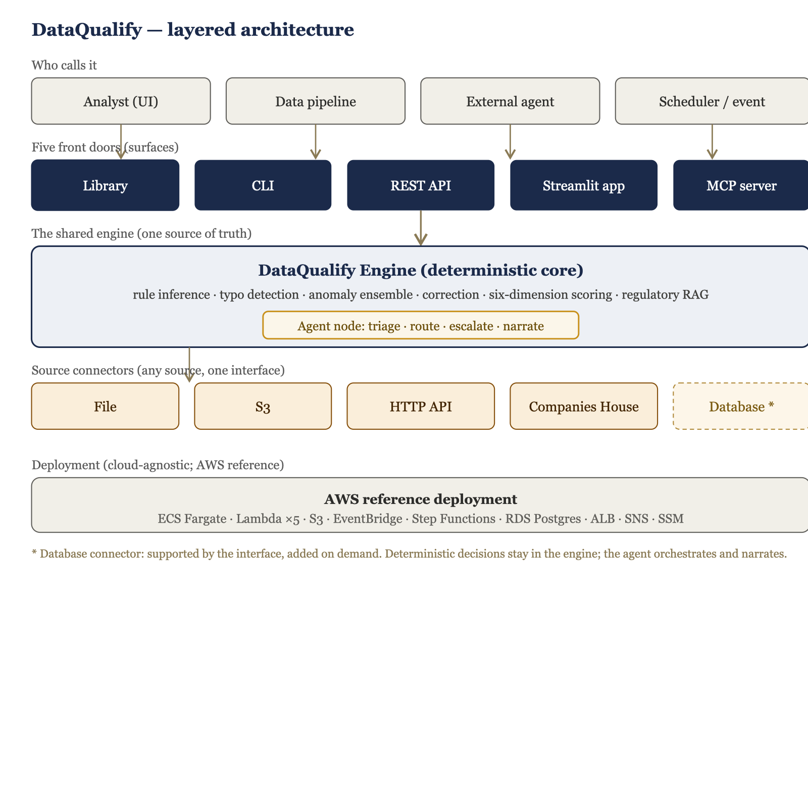

# DataQualify — System Architecture

Explainable, weakly-supervised data quality for tabular financial data. This is
the engineer-facing overview; a fully formatted version is available as a Word
document.

## The organising idea

One deterministic engine is the single source of truth. Everything else — the
surfaces that call it, the connectors that feed it, the agent that triages its
output, and the cloud that hosts it — is arranged around that engine so results
are always consistent and always auditable.

## Architectural principles

- **Deterministic core.** All data-quality decisions are computed by deterministic
  code. Language models are used only for explanation, narration, and
  orchestration — never for the decision itself.
- **Weakly supervised.** The engine works from three partial knowledge sources
  (domain rules, a clean reference, unsupervised structure) rather than labelled
  per-cell error data.
- **One engine, many front doors.** A single engine is exposed through a library,
  a CLI, a REST service, an app, and a tool server. The channels cannot disagree
  because they run the same code.
- **Source-agnostic.** Any source — file, cloud storage, HTTP API, or database — is
  pulled in through one connector interface; everything downstream is identical.
- **Autonomous by default, human where it matters.** A connected source is
  processed automatically; a human reviews only the batches the agent routes to
  review or quarantine.
- **Auditable throughout.** Every finding carries its rule, expected value,
  rationale, and a regulatory citation; every batch is tracked.

## The core engine

Framework-agnostic Python. Given a dataset, an optional clean reference, and
optional rules, it returns quality scores across six dimensions, an overall score,
cell-level issues, a corrected copy, and an audit trail. Five stages:

| Stage | What it does |
|---|---|
| Rule consolidation & inference | User rules take precedence; types, presence, allowed values, and format patterns are inferred from the reference for undescribed columns. |
| Hybrid error detection | Rule checks (type, bounds, format, allowed set, uniqueness) plus a Levenshtein typo layer for free-text misspellings. |
| Anomaly scoring | Isolation Forest + Local Outlier Factor ensemble on the clean reference; threshold from a two-component Gaussian mixture antimode. |
| Correction suggestion | Ranked suggestions (set-membership snapping, rule-consistent transforms, similarity retrieval, corpus aliases); abstains when unsure. |
| Scoring & explainability | Six dimensions into an overall score; a human-readable artifact per finding. |

On clean reference data the false-positive rate is under one per cent — analysts
are not drowned in false alarms.

## The five surfaces

| Surface | For | How it is used |
|---|---|---|
| Python library | Data scientists, pipelines | `import dataqualify; dq.validate() / dq.run_batch()` |
| CLI | Batch jobs, CI, cron | `dataqualify validate / run / batches`; exit code gates downstream |
| REST API | Services, the batch pipeline | HTTP endpoints secured by an API key |
| Streamlit app | Analysts | Multi-page UI incl. the Pipeline Monitor |
| MCP server | External agents | `validate / run_batch / list_batches / infer_rules` as tools |

## Source connectors

A connector implements one method that returns a dataframe; everything downstream
is unchanged. Adding a new source (a database, a queue, a warehouse) is a small,
self-contained addition.

| Connector | Source | Status |
|---|---|---|
| File | CSV, Parquet, Excel, JSON | Built |
| S3 | `s3://bucket/key` | Built |
| HTTP API | Any JSON endpoint | Built |
| Companies House | UK company API | Built |
| Database | Postgres, MySQL, … | Supported by the interface; added on demand |

## The autonomous batch flow

A source is connected once; each arrival is fetched → validated by the engine →
triaged by the agent → recorded as a tracked batch with its result and verdict.
The same headless `run_batch` function drives this from the CLI, the Pipeline
Monitor page, the REST service, and the MCP tools.

## The agent node

After validation, the agent decides what to do with the batch. The routing
decisions are **deterministic and auditable** (computed from scores and issue
severities); the language model is used only to phrase the narrative.

| Function | Description |
|---|---|
| Triage | Classify the outcome as ok / warn / critical. |
| Route | Accept downstream, route to review, or quarantine. |
| Escalate | Flag trends — score drops, repeated failures. |
| Narrate | A plain-English summary with recommended actions. |

## Batch tracking

Every run is recorded — SQLite by default, the cloud relational database in
production — with: `batch_id`, `source`, `timestamp`, `status`, `rows`, `columns`,
`duration`, `overall_score`, `passed`, `issues_count`, `verdict`, `severity`,
`narrative`, `sink`. Visible from the CLI, the REST service, and the Pipeline
Monitor page.

## Cloud deployment (AWS reference)

Cloud-agnostic by design; AWS is the reference. Two planes over the shared engine:
an event-driven batch pipeline and a long-running service for the app + API.

| Layer | Services |
|---|---|
| Ingestion | S3 (inbox, output, reference) + EventBridge trigger |
| Orchestration | Step Functions driving five Lambda functions |
| Compute | ECS Fargate (engine, API, app) + ECR |
| State | RDS PostgreSQL (batch history, audit) |
| Networking / alerting | Application Load Balancer + SNS |
| Security / config | SSM Parameter Store + IAM |

## Security & governance

- Deterministic, auditable decisions — no model makes a data-quality or routing call.
- Complete audit trail — rule, expected value, rationale, regulatory citation per finding.
- Human accountability — corrections are suggested, not auto-applied; the source is never mutated; write-back is approval-gated.
- Data residency — language-model inference can run locally; deploy inside a private network.
- Access control — app login; API key in an encrypted parameter store.

> **Known gap:** the reference load balancer currently serves HTTP. TLS and tighter
> network controls are required before production use with real customer data — a
> deployment-hardening task, not an engine change.

## Extensibility

- **Add a source** — implement the connector interface (one method) and register it.
- **Add a surface** — call the same engine library and headless `run_batch`.

New sources and callers plug into fixed, well-tested interfaces; the deterministic
core they depend on does not change.
